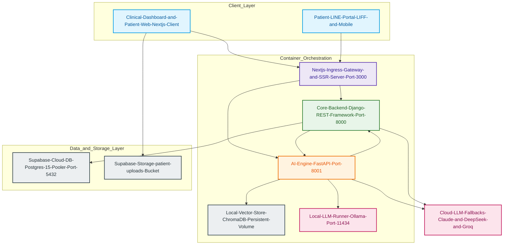

# TSPI Platform — System Architecture & Service Relationships

This document provides a highly detailed, comprehensive analysis of the **TSPI (Therapeutic Systems & Patient Intelligence) Platform** architecture. The system is designed as a secure, containerized, multi-tiered Clinical AI Operating System tailored for Functional Medicine and Integrative Health.

---

## 1. System Architecture Overview

The TSPI platform is built around a modern, decoupled architecture containerized using Docker. It consists of three primary application tiers, a local LLM runner, a cloud-hosted relational database, and an isolated vector store.



---

## 2. Key Components Breakdown

### 2.1. Client & Ingress Layer (Next.js 14+)
* **Technology Stack**: Next.js 14 (App Router), TypeScript, TailwindCSS, Axios, `@supabase/supabase-js`.
* **Container Name**: `tspi_frontend`
* **Exposed Port**: `3000` (Map: `3000:3000`)
* **Core Responsibilities**:
  * Serves the **Clinical Dashboard** (for doctors/staff) to visualize EMR records, appointment timetables, dynamic AI suggestions, temporal trajectories, and therapeutic matrices.
  * Serves the **Patient Portal** and **LINE LIFF** integrations, enabling patients to register, upload clinical lab reports (PDF/images), and submit audio files.
  * **Ingress API Gateway**: The frontend operates as a unified ingress reverse proxy to resolve mixed-content security policies (SSL over HTTPS):
    * **Catch-all Route `/api/[...path]`**: Captures client Axios requests and forwards them asynchronously to the Django backend (`http://core_backend:8000`), enforcing trailing-slash routing and standard HTTP headers.
    * **Rewrites `/engine/:path*`**: Next.js rewrites traffic directly to the internal FastAPI engine (`http://ai_engine:8000`), avoiding client CORS errors and exposing only a single public surface.

### 2.2. Core Backend Layer (Django REST Framework)
* **Technology Stack**: Python 3.12, Django REST Framework (DRF), SimpleJWT, WhiteNoise.
* **Container Name**: `tspi_core_backend`
* **Exposed Port**: `127.0.0.1:8000` (Bound to loopback to enforce Next.js gateway security).
* **Core Responsibilities**:
  * **Database & Master Data Management**: Standardizes relational schemas for `Patient` EMR records, `Visit` diagnostics, `LabResult` standardizations, `Diagnosis` categorizations (ICD codes), `Treatment` plans, and `Appointment` calendars.
  * **Clinical Framework Models**: Manages standard taxonomies:
    * `ClinicalDomain`: 12 high-level biological categories (e.g., D1 Cellular Health).
    * `ClinicalAxis`: 39 mechanistic axes (e.g., A1-A39).
    * `ClinicalSubAxis`: 114 detailed sub-markers (A/B/C/D per axis).
    * `ClinicalModule`: PhytoCore botanical therapeutic protocols.
    * `ClinicalModuleMapping`: Direct relevance scoring links between modules and axes.
  * **Orchestration & Validation**:
    * `AIValidationWorkflow`: Acts as a doctor validation layer where generated AI engine results must be reviewed, modified, or approved before patient delivery.
    * `OutcomeRecord`: Preserves historical pre- and post-treatment clinical state to feedback weights learning.
  * **External API Handlers**: Integrates Speech-to-SOAP translation via the Anthropic Claude API.

### 2.3. AI Engine Layer (FastAPI)
* **Technology Stack**: Python 3.12, FastAPI, Pydantic, HTTPX, NetworkX.
* **Container Name**: `tspi_ai_engine`
* **Exposed Port**: `8001` (Map: `8001:8000`)
* **Core Responsibilities**:
  * **Clinical Scoring & Graph Engine**:
    1. Standardizes raw patient triggers (Symptoms, normalized Labs, Lifestyle) into scores.
    2. Builds a **Directed Graph (NetworkX)** representing biological axis dependencies.
    3. Runs node score propagation to identify secondary burdens.
    4. Evaluates PageRank-based algorithms to discover **Root Causes**.
  * **Registry Rules Engine**: Executes complex clinical rulesets based on patient state (e.g., axis limits, conditions) using validation, normalization, and execution pipelines.
  * **RAG System (Retrieval-Augmented Generation)**:
    * Synchronizes real-time botanical metadata from the database to ChromaDB vectors incrementally (utilizing hash change verification).
    * Conducts vector queries using ChromaDB collections (`clinical_axes`, `modules_kb`, `herbal_kb`).
  * **Longitudinal Feedback Loop**:
    * Evaluates patient historical trajectories over time via `/engine/temporal/analyze`.
    * Runs dynamic axis weight calibration via `/engine/learning/outcome` (feedback learning).

### 2.4. LLM & Inference Layer (Ollama / Cloud Fallbacks)
* **Local Runner**: `tspi_ollama` running `ollama/ollama:latest` on Port `11434`.
  * **Primary Local LLM**: `qwen2.5:14b` (GPU-accelerated for high-quality bilingual Thai/English processing and medical reasoning).
* **Cloud Fallbacks**: Configured inside `.env` to execute Claude (Anthropic), DeepSeek, or Groq completions depending on network conditions, cost parameters, or heavy workload requirements.

### 2.5. Storage & Databases (Supabase Cloud + ChromaDB)
* **Relational Core**: Hosted PostgreSQL 15 on Supabase Cloud (`aws-1-ap-northeast-1.pooler.supabase.com`). Django talks directly via a secure connection pooler.
* **Object Store**: Supabase Storage bucket (`patient-uploads`). Frontend uploads patient clinical assets and voice files directly using the Supabase Anon client.
* **Vector Core**: Persistent ChromaDB instance stored in the `knowledge_base` Docker volume for sub-second semantic retrieval.

---

## 3. High-Level Data Flows & Service Relationships

### 3.1. Clinical AI Intake & Axis Scoring Pipeline

```
[Patient / User]
       │
       ▼ (1) Upload voice audio / lab files / symptoms
[Next.js Client] ───(2) Save static file direct to bucket───► [Supabase Storage]
       │
       ▼ (3) Submit form data (/api/...)
[Next.js Proxy]
       │
       ▼ (4) Normalize inputs, create EMR record
[Django Core Backend]
       │
       ▼ (5) Delegate scoring payload
[FastAPI AI Engine] ◄───(6) Pull related context (RAG)───► [ChromaDB / Vector store]
       │
       ▼ (7) Call LLM for report generation
 [Ollama (Local GPU) / Cloud LLMs]
       │
       ▼ (8) Return EngineResult
[FastAPI AI Engine] ───(9) Save to EngineResult table───► [Django Core Backend]
                                                                  │
                                                                  ▼
                                                      [Supabase PostgreSQL]
```

### 3.2. Doctor Review & Dynamic Weight Optimization Loop

```
[Doctor]
   │
   ▼ (1) Review recommendations & modify treatment modules
[Next.js Client]
   │
   ▼ (2) Patch validation status / approve SOAP Notes (/api/ai/validations/)
[Django Core Backend]
   │
   ▼ (3) Trigger Outcome Evaluation (/api/ai/outcomes/)
[Django Core Backend] ───(4) POST /engine/learning/outcome ───► [FastAPI AI Engine]
                                                                        │
                                                                        ▼
                                                             Evaluate delta burden &
                                                             modify axis definition weights
                                                                        │
                                                                        ▼
                                                             Update axes_definitions.json 
                                                             & Hot-Reload Axis Engine
```

---

## 4. Key Security & Operational Safeguards

1. **Mixed Content / CORS Evasion**: Next.js proxies all core communication internally. The browser client only speaks directly to Port 3000 (Next.js Ingress Gateway) and the Supabase Storage endpoint, solving complex SSL deployment issues.
2. **Database Resilience**: PostgreSQL connection pool sizes are strictly limited (`CONN_MAX_AGE: 60`) in Django to balance Supabase transactional limits.
3. **Registry Engine Safe Overrides**: FastAPI implements execution layers that filter recommended modules against custom conditions and safety alerts before recommending them, ensuring clinical safety boundaries are never violated.
4. **DLQ (Dead Letter Queue)**: During database-to-ChromaDB synchronization, rows that fail parsing or embedding are quarantined rather than crashing the synchronization loop, ensuring stable RAG query pipelines.
