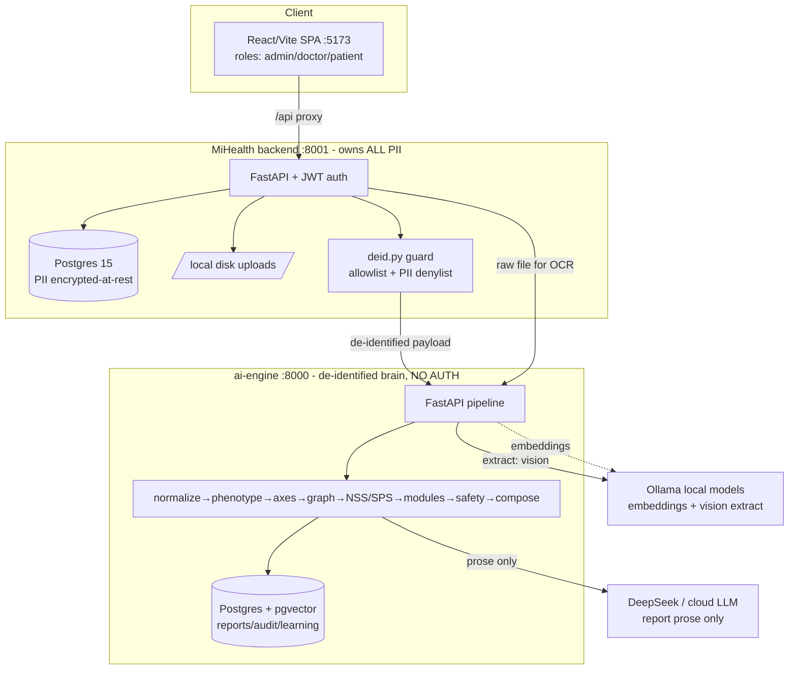

# TSPI Platform — Senior Architect / Principal Engineer Review

**Reviewer role:** Principal Software Architect · Distributed-Systems · Senior Python · Security · SRE · Performance
**Scope reviewed:** `C:\workspace\tspi_new\docs` (design/architecture) + `C:\workspace\tspi_new\apps` (source)
**Method:** Full read of the ai-engine (FastAPI brain) and MiHealth (backend + frontend), all design docs, Docker/deploy config, migrations, tests. The ai-engine test suite was executed in a clean virtualenv — **73/73 tests pass**. Findings below are evidence-based and reference exact files/lines; where I could not verify something I say so.
**Review date:** 2026-08-10

> One-line orientation for the reader: **the clinical reasoning core is unusually thoughtful and well-tested; the operational, security, and governance-enforcement layers around it are prototype-grade and are the reason this is not production-ready.** The gap between what the governance docs *promise* and what the code *enforces* is the single most important theme of this review.

---

## 1. Executive Summary

TSPI is a two-service clinical decision-support system: an **ai-engine** ("the brain", FastAPI) that deterministically maps de-identified patient data onto a fixed ontology (3 Keys → 9 Steps → 12 Domains → 39 Axes → 180 Networks → Modules) and produces a Case Report, and **MiHealth** (FastAPI backend + React/Vite frontend) that holds all PII, captures intake/labs/consent, de-identifies, calls the brain, and gates delivery behind doctor validation.

**What is genuinely good.** The de-identification boundary (`mihealth-backend/app/deid.py`) is the strongest single piece of engineering in the repo: an allowlist + PII-denylist guard that raises rather than leaks. The evidence model (`app/evidence.py`) — explicit `NOT_ASSESSED`, HYPOTHESIS-never-scores, weighted completeness, four separated dimensions — is a mature answer to "no data must never read as normal." Red-flag screening is deterministic, runs first, and keeps critical-value alerts on a separate un-averaged layer (`app/red_flags.py`). The learning loop is correctly propose-only for the global model (`app/learning.py`). The clinical logic is deterministic and the LLM is confined to prose composition — a good risk posture. Test discipline on the engine is high (73 targeted behavioural tests).

**Biggest risks (why it is not production-ready).**

1. **Governance is documented but not enforced in code.** The "constitutional rule" that the system *fails closed when a registry is unapproved* is not implemented: the module registry the engine actually uses is stamped `production_allowed: false`, `approval_status: UNREVIEWED`, `framework_version: LEGACY-AXIS-NUMBERING`, yet it is loaded and used to generate module recommendations with no gate (`app/knowledge/repository.py`).
2. **The ai-engine has no authentication or authorization at all**, and its port is published to the host. Any caller who can reach it can generate reports, read stored reports, and — critically — **approve global model-update proposals** (`/learning/proposals/{id}/decide`), the one action that is supposed to be clinician-gated.
3. **PHI is protected by a publicly-known encryption key by default.** MiHealth's "PII encrypted at rest" derives its Fernet key from `JWT_SECRET`, whose Docker default is the literal string `change-me-to-a-long-random-string` (`encryption.py` + `docker-compose.yml`).
4. **Process-local mutable state under a multi-worker deployment.** Learned axis weights are cached in a module-global that only one uvicorn worker invalidates on write (`app/store.py`), so approved weight changes are silently inconsistent across workers (default `WEB_CONCURRENCY=2`).
5. **The primary architecture document does not describe the system that was built.** `docs/02-reference/system_architecture_report.md` describes Django + Next.js + Supabase + ChromaDB + LINE LIFF; the actual system is FastAPI + FastAPI + React/Vite + Postgres/pgvector with none of those components.

**Biggest architectural concerns.** Thin evidence produces maximal severity (a single out-of-range lab yields NSS 100 / "Advanced Network Failure" / 15 caps-per-day dosing); the categorical contraindication *exclusion* gate is unreachable dead code; async endpoints call blocking DB code; and the MiHealth backend — which holds all PHI and the de-id boundary — has **zero automated tests**.

**Overall maturity.** The *intellectual* design is senior-level and largely sound. The *operational and security* implementation is an early prototype. This is a common and recoverable shape: the hard clinical thinking is done; the productionization is not.

**Production-readiness verdict: 🔴 NOT PRODUCTION READY** (for anything touching real patients or PHI). It is a strong, demonstrable pilot-track prototype. The blockers are concrete and mostly mechanical to fix — see the P0 list in §15.

---

## 2. Architecture Overview (as actually built)



**Reasoning flow inside the brain (accurate to code):**
`red_flag screen → clinical phenotype → normalize signals → map 39 axes (+RAG hypotheses) → root-cause graph (NetworkX PageRank) → NSS v0.3 / SPS → severity level → module match v1.0 (safety gate → score → dedupe → ceiling) → dose → safety flags → compose (LLM or deterministic markdown) → persist draft → doctor-validation gate.`

**Trust boundaries:** browser ↔ MiHealth (JWT), MiHealth ↔ brain (**none — unauthenticated HTTP**), brain ↔ Ollama/cloud LLM. PII is supposed to stop at MiHealth; see §10 for one place raw PHI crosses into the brain.

---

## 3. What Is Done Well (retain these)

| # | Strength | Why it's good | Evidence |
|---|---|---|---|
| G1 | **De-identification guard** | Single choke point; allowlist *and* PII denylist; raises on any disallowed/PII key, including per-lab-row. This is exactly how a PHI boundary should be built. | `mihealth-backend/app/deid.py` `_assert_clean`, `ALLOWED_KEYS`, `PII_KEYS` |
| G2 | **Evidence & confidence model** | `NOT_ASSESSED` is explicit and never "normal"; HYPOTHESIS can never raise a score; completeness is CORE/SUPPORTING/OPTIONAL-weighted (not a raw ratio); biological uncertainty separated from confidence. Directly prevents "no data = healthy." | `app/evidence.py`, `app/pipeline/axis_mapper.py::_finalize` |
| G3 | **Deterministic red-flag + critical-value layer** | No LLM in the safety path; critical values are a separate layer that survives a low NSS; unit-aware (mg/dL vs mmol/L). | `app/red_flags.py`, `data/red_flag_rules.json`; tests `test_critical_value_survives_a_low_nss`, `test_critical_value_rules_are_unit_aware` |
| G4 | **Propose-only population learning** | Global model can only change via an explicit clinician-approved proposal path; patient-level adaptation is bounded (±5%/cycle, ±20% cumulative) and sustained-improvement gated. Correct compliance posture. | `app/learning.py`, `app/store.py::decide_proposal` |
| G5 | **Deterministic-first, LLM-for-prose-only** | All clinical math is in code; the LLM composes narrative from structured facts and always has a deterministic markdown fallback. Lowers clinical risk and token cost. | `app/pipeline/report_composer.py`, `app/llm/provider.py` |
| G6 | **Marker Registry semantics** | `value_source_type` (MEASURED/DERIVED) separated from `direction_rule`; context-dependent ferritin; unit-guarded HOMA-IR that refuses to compute on unknown units. Genuinely careful clinical modelling. | `app/markers.py`; tests `test_ferritin_*`, `test_homa_ir_formula_is_unit_specific_and_guarded` |
| G7 | **Doctor-validation delivery gate** | `deliverable` only flips true after validation *and* not `release_block`; patients can read only deliverable reports; append-only audit on both services. | `mihealth-backend/app/routers/reports.py`, `app/pipeline/orchestrator.py` |
| G8 | **Graceful degradation of optional deps** | RAG returns `[]` without pgvector; extraction falls back heuristic→vision; LLM chain falls back to deterministic report. The happy path never hard-crashes on a missing optional service. | `app/knowledge/retrieval.py`, `app/pipeline/extraction.py` |

These are the parts I would explicitly **not** rewrite.

---

## 4. Critical Issues (🔴)

### C1 — Unapproved, legacy-numbered module registry is used for clinical recommendations (governance not fail-closed)
**Category:** Correctness / Governance · **Severity:** 🔴 CRITICAL · **Priority: P0**
**Location:** `app/knowledge/repository.py::_official()` / `modules_for_axis()`; data in `app/ai-engine/data/axis_module_official.json` & `module_registry.json`
**Current behaviour:** `_official()` loads `axis_module_official.json` and serves it directly. That file's header is:
`approval_status: UNREVIEWED`, `mapping_status: UNREVIEWED`, `authoritative: false`, `production_allowed: false`, `framework_version: LEGACY-AXIS-NUMBERING`, with `quarantine_reason` explicitly stating the axis column is *not* a production source of truth. `module_registry.json` is `registry_version: 0.1.0-draft`. Nothing in the load path checks `production_allowed`/`approval_status`.
**Why it's a problem:** `PROJECT_STATUS.md` §2 lists as a *constitutional rule*: "the system fails closed when a registry is missing or unapproved" and "official-registry-only resolution … APPROVED only." The code does the opposite — it silently uses an explicitly-quarantined, legacy-numbered registry to produce the module plan. The one module I traced (`H-003 ABSORN`) maps to 10 primary axes including `A27`, exactly the "same-number-different-meaning" case the docs warn is unsafe (legacy Metabolic Balance ≠ current A27/Glycation).
**Technical impact:** Every module recommendation the engine emits is derived from data the project's own experts have not approved and that uses the wrong axis numbering. Clinically wrong module→axis attribution; the whole "APPROVED-only" guarantee is unenforced.
**Recommendation:** Add a hard gate in `repository.py`: refuse to load any registry whose `production_allowed != true` / `approval_status != APPROVED` (or `CLINICALLY_REVIEWED` in a controlled flag), and return an explicit `REGISTRY_UNAVAILABLE` state that the pipeline surfaces as "modules not assessed" — fail closed, matching the documented rule.
**Alternative:** Load it but force every resulting `ModulePick.module_status = "PROVISIONAL_UNAPPROVED_REGISTRY"`, block `deliverable`, and stamp the report; only if you deliberately want provisional demos.

### C2 — ai-engine has no authentication/authorization, and the model-approval endpoint is exposed
**Category:** Security (Broken Access Control, OWASP API1/API5) · **Severity:** 🔴 CRITICAL · **Priority: P0**
**Location:** `app/api/routes.py` (all endpoints); `docker-compose.yml` (`tspi-api ports: ["8000:8000"]`)
**Current behaviour:** No dependency, API key, mTLS, or network policy on any route. `POST /learning/proposals/{proposal_id}/decide?reviewer=x&approve=true` applies a global clinical-model weight change with only a free-text `reviewer` query param. `GET /reports/{report_id}` returns full stored reports. Port 8000 is published to the host in the unified compose.
**Why it's a problem:** The architecture doc claims the core backend is "bound to loopback to enforce gateway security," but the actual brain is directly reachable and unauthenticated. The single most safety-sensitive action in the system — mutating the global clinical model — is callable by anyone with network access, with no identity, no auth, no audit of *who* really approved.
**Technical impact:** Unauthenticated global model tampering, report data exfiltration (de-identified, but still clinical data + audit), and unrestricted report/plan generation (LLM cost + safety). This alone blocks any non-localhost deployment.
**Recommendation:** Put the brain on a private network (never publish 8000); require a service-to-service credential (mTLS or signed API key) from MiHealth; and make `/learning/proposals/.../decide` require an authenticated clinician identity propagated and verified, not a query string. Add authorization tests.
**Alternative:** If the brain must be a separate deployable, front it with an authenticating gateway and IP-allowlist MiHealth only.

### C3 — PHI encrypted with a publicly-known default key
**Category:** Security (Cryptographic failure, OWASP A02) · **Severity:** 🔴 CRITICAL · **Priority: P0**
**Location:** `mihealth-backend/app/encryption.py::_fernet()`; `config.py` (`jwt_secret` default `dev-only-change-me`, `pii_encryption_key` default `""`); `docker-compose.yml` (`JWT_SECRET: ${JWT_SECRET:-change-me-to-a-long-random-string}`)
**Current behaviour:** Patient `first_name/last_name/phone/email/address` are stored via `EncryptedString`, whose key is `SHA256(pii_encryption_key or jwt_secret)`. If `PII_ENCRYPTION_KEY` is unset (default) the PHI key is derived from `JWT_SECRET`, and the compose default JWT secret is a well-known literal.
**Why it's a problem:** "Encrypted at rest" is defeated if the key is a public constant; and coupling the PHI key to the JWT signing secret means one leaked secret compromises both auth *and* stored PHI. `EncryptedString` also silently tolerates plaintext on decrypt failure, so a misconfiguration can store PHI unencrypted with no error.
**Technical impact:** Trivial PHI decryption if the DB leaks and the default is unchanged; auth-forgery + PHI compromise share a single secret.
**Recommendation:** Fail startup if `PII_ENCRYPTION_KEY` (a distinct, high-entropy key) is missing in any non-local env; separate it from `JWT_SECRET`; source both from a secrets manager. Add a startup guard that refuses known default secrets when `TSPI_ENV`/equivalent ≠ local. Consider column-level KMS envelope encryption for real PHI.
**Alternative:** Move PHI encryption to the database layer (pgcrypto / managed TDE) with KMS-managed keys.

### C4 — Learned axis weights cached per-process; incoherent across workers
**Category:** Distributed state / Correctness · **Severity:** 🔴 CRITICAL (clinical correctness) · **Priority: P0**
**Location:** `app/store.py` (`_WEIGHTS_CACHE`, `get_axis_weights`, `set_axis_weight`, `invalidate_weights_cache`); deployment `--workers ${WEB_CONCURRENCY:-2}`
**Current behaviour:** `get_axis_weights()` memoizes the axis-weight table in a module-global dict. `decide_proposal()`→`set_axis_weight()`→`invalidate_weights_cache()` clears the cache **only in the worker that served the approval request**. Other uvicorn workers keep serving stale weights until restart.
**Why it's a problem:** SPS prioritisation (and any weight-consuming logic) becomes nondeterministic per worker after an approval — the same patient can be scored differently depending on which worker answers. This is a classic process-local-state-in-a-multi-process-server bug.
**Technical impact:** Silent, hard-to-debug clinical-scoring divergence across replicas/pods; violates the "one immutable, reproducible analysis" intent.
**Recommendation:** Drop the in-process cache for a shared cache (Redis) with pub/sub invalidation, or read weights from the DB per request with a short TTL and a cache-bust signal, or (simplest correct) don't cache and rely on the DB (measure first — it's a tiny table). At minimum, invalidate across workers.
**Alternative:** Make weight changes a versioned row read at request start so every worker converges on the latest version deterministically.

### C5 — Thin evidence produces maximal severity and aggressive dosing
**Category:** Clinical correctness / Scoring design · **Severity:** 🔴 CRITICAL · **Priority: P0/P1**
**Location:** `app/pipeline/axis_mapper.py` (`_SEV_SCORE` pathological=100; a lab flagged up/down → `Severity.pathological`), `app/pipeline/severity.py::compute_nss` (mean of included axis values × network factor), `app/knowledge/dosing.py` (NSS 61–100 → Level 3 → 15 caps/day)
**Current behaviour (verified by running the engine):** A patient with a *single* out-of-range CRP and no other data yields `NSS 100`, `Level 3 "Advanced Network Failure"`, and a module plan dosed at 15 caps/day. Because NSS is the *mean* of included axes and any single flagged lab is scored `pathological=100`, one abnormal value = 100.
**Why it's a problem:** The 5-Aug ruling correctly says completeness must not *reduce* severity — but the implementation makes the opposite failure: sparse data yields the *maximum* severity and the most aggressive dosing tier. "Provisional" labelling is present, but the headline NSS/level/dose a clinician sees is extreme. A single mildly-elevated marker should not read as end-stage network failure.
**Technical impact:** Systematic over-severity and over-dosing on thin inputs; erodes clinician trust and creates real safety exposure if a provisional plan is acted on.
**Recommendation:** Separate *magnitude* from *severity class* — map a marker's distance-from-optimal (the `badness` already computed in `markers.interpret`) onto graded severity rather than snapping any abnormality to 100; and make NSS coverage/# of assessed axes damp the headline for very low coverage (report severity honestly but don't let n=1 pathological → NSS 100). Gate dosing tier on assessment status, not just NSS.
**Alternative:** Keep severity but cap the *level/dose* mapping when `assessment_coverage` or included-axis count is below a threshold, pending the official NSS formula.

---

## 5. High-Priority Issues (🟠)

### H1 — Absolute-contraindication exclusion gate is unreachable dead code
**Severity:** 🟠 HIGH · **P1** · `app/knowledge/repository.py::is_contraindicated` (always `return False`), consumed by `app/pipeline/module_matcher.py::_absolute_contraindication`
The Phase-10 design says safety is a hard *gate* that sets `module_status=EXCLUDED` before ranking. But the only predicate driving exclusion (`is_contraindicated`) is hardcoded `False`, so **no module is ever excluded** by contraindication — everything becomes `PASS`/`PASS_WITH_MONITORING`. The categorical `CONTRAINDICATED` path exists but can't fire from patient meds. Real drug-herb absolute contraindications never gate out a module. Wire `is_contraindicated` to the contraindication/drug-herb data (per the design), and add a test that a contraindicated module is actually EXCLUDED (current tests assert the enum/penalty shape, not the exclusion).

### H2 — MiHealth backend has zero automated tests
**Severity:** 🟠 HIGH · **P1** · no `apps/mihealth-backend/tests/`
The service that holds *all* PHI, issues JWTs, enforces role-based access, and runs the de-identification boundary (`deid.py`, described in-code as "the single most important function in MiHealth") has no tests. The de-id guard, RBAC (`_authorize`, `require_roles`), consent gating, and the validate/deliverable state machine are all untested. Given C1–C3 live here too, this is a serious assurance gap. Add pytest coverage: de-id guard rejects PII/extra keys; patient cannot read others' records; patient cannot confirm labs or generate plans; only assigned doctor can validate; consent-missing blocks generation.

### H3 — Async endpoints perform blocking DB + per-call DDL
**Severity:** 🟠 HIGH (performance/scalability) · **P1** · `app/api/routes.py` (`async def`), `app/store.py`
`/analyze`, `/report`, etc. are `async def`, but call synchronous SQLAlchemy (`store.audit`, `get_axis_weights`, `save_report`) directly on the event loop — each blocks the loop for the duration of the DB round-trip. Worse, nearly every write helper calls `init_db()` first, which runs `Base.metadata.create_all` (a metadata reflection/DDL check) **on every request**. Under concurrency this serializes the event loop and adds needless DB chatter. Move DB work off the loop (`run_in_threadpool` or an async driver), and call `init_db()` exactly once at startup, not per operation.

### H4 — Primary architecture document describes a different system than the one built
**Severity:** 🟠 HIGH (maintainability/onboarding) · **P1** · `docs/02-reference/system_architecture_report.md`
It specifies Django REST + Next.js ingress + Supabase Cloud Postgres + ChromaDB + LINE LIFF + `tspi_frontend/tspi_core_backend` containers on ports 3000/8000/8001. The actual system has none of these — it's FastAPI (brain) + FastAPI (MiHealth) + React/Vite + Postgres/pgvector, no Django, no Next.js, no Supabase, no ChromaDB, no LINE. A new engineer reading the canonical architecture doc would build the wrong mental model. Either mark it clearly as an aspirational/alternative design or rewrite it to match `README.md`/`PORTAL_README.md` (which *are* accurate). See §9.

### H5 — No request size limits; whole uploads read into memory
**Severity:** 🟠 HIGH (DoS / resource exhaustion) · **P1** · `mihealth-backend/app/routers/documents.py::upload_document` (`data = await file.read()`), `app/api/routes.py::extract_endpoint`
Uploaded files are fully read into RAM with no max-size, MIME allowlist, or count limit, then written to local disk. A few large uploads can exhaust memory/disk. Add a streamed size cap, MIME/type validation, and per-user quotas; store to object storage with limits rather than local disk (see H8).

### H6 — Dedup key can collapse clinically distinct modules
**Severity:** 🟠 HIGH (clinical correctness) · **P2** · `app/module_match.py::dedupe_key`
`dedupe_key = dose_type | top-3 sorted primary axes`. Two mechanistically different products that happen to share their top-3 primary axes are treated as one "mechanism," and the lower-ranked one is dropped as `DUPLICATE_MECHANISM`. Real mechanism de-duplication needs ingredient/mechanism identity, not an axis-overlap proxy. Until the mechanism data exists, make the key more conservative (e.g. require ingredient overlap) or log what was de-duplicated so a clinician can see drops.

### H7 — No connection-pool tuning; sessions opened/closed per call; multi-driver mix
**Severity:** 🟠 HIGH (reliability at load) · **P2** · `app/knowledge/db.py`, `app/store.py`, `mihealth-backend/app/database.py`
The brain creates the engine with defaults (pool 5 + 10 overflow) and opens a fresh session for every tiny operation, including inside loops (`repository.axis()` per axis add). Against Supabase/pooled Postgres this can exhaust connections under the documented 1,000 plans/day peaks. The deployment/cost doc even calls out `CONN_MAX_AGE`/PgBouncer for a Django app that doesn't exist. Configure explicit pool sizes, reuse sessions per request (a request-scoped session/`Depends` in the brain like MiHealth already does), and add PgBouncer as the docs intend.

### H8 — Local-disk file storage breaks under horizontal scaling
**Severity:** 🟠 HIGH (scalability/reliability) · **P2** · `mihealth-backend/app/storage.py`, `main.py` uploads volume
Uploads are written to a local directory; `download_document`/`run_ocr` read from local paths. With more than one MiHealth replica, an upload handled by pod A is unreadable by pod B. The design docs assume S3/GCS object storage; the code does not implement it. Move to object storage (pre-signed URLs) before scaling out.

### H9 — Schema managed two ways (Alembic *and* `create_all`)
**Severity:** 🟠 HIGH (data-integrity/ops) · **P2** · brain `entrypoint.sh` (seed → `alembic upgrade head`) + `init_db()`'s `create_all` on every call; MiHealth `main.py` uses `create_all` only, "replace with Alembic later"
The brain runs Alembic migrations *and* `create_all`; MiHealth has no migrations at all. `create_all` will happily create tables Alembic thinks it owns, hiding drift and making migrations unreliable. Additionally `entrypoint.sh` runs `scripts.seed_db`, whose `seed_all()` **unconditionally wipes and reloads the reference tables on every container start** — destructive if anything mutated them and racy across replicas. Pick Alembic as the single source of truth for both services; make seeding idempotent and guarded.

### H10 — Root-cause graph and several mappings are hardcoded seed data
**Severity:** 🟠 HIGH (clinical validity) · **P2** · `app/pipeline/graph_engine.py` (`_SEED_EDGES`), `axis_mapper._CONCEPT_TO_AXES`, `normalizer._SEED_CONCEPTS`, `sequencer/_FOUNDATION_AXES`, `step_locator`
The "root-cause chain via PageRank" runs over ~10 hand-seeded axis edges; concept→axis and symptom→concept maps are small illustrative dictionaries with `TODO(Phase 2)` markers. This is fine as scaffolding but is presented in outputs as mechanistic root-cause analysis. The 180-network layer that is *supposed* to carry propagation is loaded as data but, per the plans, `network_match` is still a hardcoded `0.0` placeholder and edges don't exist. Make the provisional nature explicit in the report and don't let seed-graph "root cause" read as validated.

---

## 6. Medium / Low Issues

**🟡 MEDIUM**

- **M1 — JWT in `localStorage`, no revocation, long-lived refresh.** `frontend/src/api/client.ts` stores tokens in `localStorage` (XSS-exfiltratable); refresh tokens last 7 days with no server-side revocation/blacklist and no rotation-reuse detection. For PHI, prefer httpOnly cookies + short refresh + rotation. (`security.py`, `client.ts`)
- **M2 — Confusing dead consent default.** `routes.py::_require_consent` default `p.consent.get(scope, scope == "ai_analysis" and False)` always evaluates to `False`; harmless but misleading — simplify to `False`.
- **M3 — No liveness/readiness distinction, no metrics/tracing.** `/health` returns static info and never checks DB/LLM/Ollama; there are no Prometheus metrics, structured logs, or tracing. Ops can't tell "up" from "ready." (`main.py` both services)
- **M4 — No container healthchecks for the app services / no graceful shutdown.** `tspi-api` and `mihealth-api` have no `healthcheck` in the unified compose; no shutdown handling for in-flight background OCR jobs. (`docker-compose.yml`)
- **M5 — Background OCR job durability.** `run_ocr` is a FastAPI `BackgroundTask` in-process; a crash/restart loses the job with no retry/queue. The cost doc assumes a real job queue (Redis/SQS) — not implemented. (`documents.py`)
- **M6 — Predictable, enumerable `case_id`.** `TSPI-YYYY-NNNNNN` sequential; combined with the unauthenticated brain `GET /reports/{report_id}` (UUID, harder) and MiHealth authz, low risk today, but sequential IDs leak volume and invite enumeration. (`util.py::next_case_id`)
- **M7 — `pip` floors, not locks.** Requirements use `>=` with a comment about Python 3.14 wheels; no lockfile/hashes → non-reproducible builds and supply-chain drift. Pin with a lock (`pip-tools`/`uv`) for prod images. (`requirements.txt`)
- **M8 — CORS `*` methods/headers + credentials.** Acceptable for local, but tighten allowed methods/headers for prod. (`mihealth-backend/app/main.py`)
- **M9 — `except Exception` swallowing.** Several broad `except Exception: pass`/`noqa: BLE001` (LLM compose fallback, seed, model rebuild) hide real errors; log at warning with context. (`report_composer.py`, `repository._ensure_seeded`, others)

**🔵 LOW**

- L1 — `ModuleProduct` table kept "for history" but module↔product is 1:1; dead schema. (`knowledge/models.py`)
- L2 — `learning.py` still carries `_MARKER_AXIS`/`_LOWER_IS_BETTER` placeholder maps alongside the Marker Registry; duplicate source of truth, drift risk.
- L3 — `CaseReport.nss_detail` doc comment says "NSS v0.1" while code is v0.3; stale inline docs in several modules.
- L4 — Real DeepSeek API key value is present in `apps/ai-engine/.env` on disk (git-ignored, **not** committed — verified via `git ls-files`), but a live secret in a working-tree dotfile should be rotated and never shipped in a handoff. (`.env`)
- L5 — `docker-compose.yml` publishes `mihealth-db` `5432:5432` to the host — dev convenience, remove for prod.
- L6 — Frontend has no tests and no error boundary; `printReport.ts` builds HTML by string concat (it does escape, good).

---

## 7. Incorrect Architecture / Design

**D-A. Governance-as-documentation instead of governance-as-code.**
```
Current design: constitutional rules (fail-closed, APPROVED-only, clinician-gated model change)
                are asserted in PROJECT_STATUS.md and enforced by convention.
        ↓
Problem:        the code loads an UNREVIEWED registry (C1), the model-approval endpoint is
                unauthenticated (C2), and cross-worker state is incoherent (C4).
        ↓
Why incorrect:  safety-critical invariants that live only in prose are not invariants.
        ↓
Recommended:    encode each constitutional rule as an executable gate + a test:
                registry approval gate, service auth on the brain, clinician identity on
                /decide, one-source-of-truth weights. Make "fails closed" a code path.
        ↓
Benefit:        the guarantees the client is told about actually hold at runtime.
```

**D-B. Stateful, cached clinical parameters inside a multi-process web server.**
```
Current: module-global _WEIGHTS_CACHE, uvicorn --workers 2+.
Problem: writes invalidate one worker; others serve stale weights (C4).
Why incorrect: shared clinical state must be externalized in a scale-out service.
Recommended: externalize weights (DB read-through / Redis) with cross-process invalidation,
             or make them immutable-versioned and read the active version per request.
Benefit: deterministic, reproducible scoring across replicas/pods — a stated requirement.
```

**D-C. Severity that snaps any abnormality to maximum.**
```
Current: any flagged lab → pathological(100); NSS = mean(included) → n=1 gives 100 → Level 3 → 15 caps/day.
Problem: sparse data yields maximal severity/dose (C5).
Why incorrect: magnitude and confidence are conflated at the *severity* step, not just NSS.
Recommended: grade severity from marker distance-from-optimal; damp headline level/dose by coverage.
Benefit: honest severity that scales with evidence; no end-stage label from one marker.
```

**D-D. "Brain is loopback-protected" boundary that isn't.**
```
Current design (doc): core backend bound to loopback, gateway-only ingress.
Actual: brain :8000 published, unauthenticated (C2).
Recommended: private network + service auth + gateway; never publish the brain.
Benefit: the trust boundary the design claims becomes real.
```

---

## 8. Incorrect Implementation (design is right, code isn't)

1. **Safety gate (design correct, code inert).** Design: contraindication → EXCLUDED before ranking. Code: `repository.is_contraindicated()` returns `False` always → gate never fires (H1). `app/knowledge/repository.py:121`.
2. **Fail-closed registry loading (design correct, code missing the check).** Design: APPROVED-only, fail closed. Code: loads `production_allowed:false` registry unconditionally (C1). `app/knowledge/repository.py::_official/_registry`.
3. **Weight invalidation (design correct, code process-local).** Design: approved weight enters the model. Code: only one worker sees it (C4). `app/store.py`.
4. **Async I/O (design correct, code blocking).** Endpoints are `async` (intending non-blocking), but call sync DB + per-request DDL (H3). `app/api/routes.py` + `app/store.py`.
5. **PII encryption (design correct, key wrong).** Design: PII encrypted at rest. Code: default key is a public constant coupled to JWT secret (C3). `app/encryption.py`.
6. **"Raw files never leave MiHealth" (doc claim vs code).** `models.py`/`PORTAL_README.md` state raw files stay in MiHealth; `documents.py::run_ocr` POSTs the raw (potentially PII-bearing) file to the brain's `/extract`. It's local-only processing and same trust domain, but it contradicts the stated boundary and writes a TSPI-side `extract` audit row (§10). Reconcile the claim with the behaviour (either "raw files stay within the platform, processed locally" or route extraction inside MiHealth).

---

## 9. Design vs Code Gap Analysis

| Area | Documented design | Actual implementation | Status | Recommendation |
|---|---|---|---|---|
| Overall stack | Django + Next.js + Supabase + ChromaDB + LINE (`system_architecture_report.md`) | FastAPI brain + FastAPI MiHealth + React/Vite + Postgres/pgvector | ❌ Does not match | Rewrite/retire the architecture report (H4) |
| De-identification | case_id+age_band+sex only; guard | Implemented with allowlist+denylist guard | ✅ Matches | Keep; add tests (H2) |
| Fail-closed on unapproved registry | Constitutional rule | No gate; loads UNREVIEWED registry | ❌ Does not match | Add approval gate (C1) |
| Brain auth boundary | Loopback/gateway-protected | Unauthenticated, port published | ❌ Does not match | Private net + service auth (C2) |
| PII encrypted at rest | Yes | Yes, but default public key | ⚠️ Partial | Distinct KMS-backed key (C3) |
| Doctor validation gate | deliverable only post-approval | Implemented + audited | ✅ Matches | Keep |
| NSS formula | v0.2 weighted avg (phases plan) / v0.3 completeness-separated (PROJECT_STATUS) | v0.3 unweighted mean × network factor | ⚠️ Partial | Reconcile docs to v0.3; fix thin-data severity (C5) |
| 180-network reasoning | Networks explain mechanism; `network_match`=25% | Networks loaded; `network_match` hardcoded 0.0, edges absent | ⚠️ Partial (by design, pending data) | Keep NOT_ASSESSED; document clearly (H10) |
| Safety = categorical gate | Excludes before ranking | Exclusion predicate always False | ❌ Does not match | Wire contraindications (H1) |
| Learning | Propose-only global; bounded patient-level | Implemented | ✅ Matches | Keep; fix weight cache (C4) |
| Job queue for plans | Redis/SQS async | In-process BackgroundTask | ❌ Does not match | Add queue (M5) |
| Object storage | S3/GCS | Local disk | ❌ Does not match | Object storage (H8) |
| Migrations | Alembic | Brain: Alembic+create_all; MiHealth: create_all only | ⚠️ Partial | Single Alembic source (H9) |
| Raw file boundary | Never leaves MiHealth | Raw file POSTed to brain /extract | ⚠️ Partial | Reconcile claim/behaviour (§8.6) |
| RBAC | patient/doctor/admin scoped | Implemented (`_authorize`, `require_roles`) | ✅ Matches | Add tests (H2) |
| Multi-worker scoring | Reproducible | Process-local weight cache | ❌ Does not match | Externalize (C4) |

---

## 10. Security Findings

**Confirmed vulnerabilities**
- **SEC-1 (Critical): Broken access control on the brain.** No auth on any ai-engine route; `/learning/proposals/{id}/decide` (global model mutation) and `/reports/{id}` reachable by any network client; port published (C2). *OWASP API1/API5.*
- **SEC-2 (Critical): Weak/known crypto key for PHI.** Default Fernet key derived from a public JWT default; PHI key ≡ auth secret (C3). *OWASP A02.*
- **SEC-3 (High): No upload validation / unbounded reads.** Memory/disk DoS; no MIME allowlist (H5). *OWASP A04/A05.*

**Potential vulnerabilities (need environment context)**
- **SEC-4: Token theft via `localStorage` XSS** (M1) — depends on frontend XSS surface; React mitigates default, but any `dangerouslySetInnerHTML`/injected HTML would expose tokens.
- **SEC-5: `EncryptedString` silent plaintext tolerance** — a decrypt failure returns raw stored value; a misconfig could persist/serve PHI in plaintext with no signal (C3-adjacent).
- **SEC-6: Predictable case_id enumeration** (M6) — low impact given MiHealth authz, but the unauthenticated brain weakens defense-in-depth.

**Best-practice improvements**
- Secrets from a manager; refuse known defaults at startup; rotate the DeepSeek key in `.env` (L4).
- httpOnly cookie auth + refresh rotation/reuse detection (M1).
- Rate limiting + request-size limits on both services.
- Egress control: the brain's report-prose path calls **cloud DeepSeek** (`LLM_PRIMARY=deepseek` in `.env`); confirm the compliance path (Bedrock/Vertex/ZDR) the cost doc recommends, since even de-identified clinical prose leaves the network.
- Non-root containers: the brain runs as `appuser` (good); MiHealth Dockerfile does not — add a non-root user.

**Explicitly not vulnerabilities:** bcrypt 72-byte truncation is documented/handled; the de-id guard is robust; no SQL injection surface found (SQLAlchemy ORM throughout, no raw string SQL except the safe `CREATE EXTENSION` DDL); no obvious SSRF/path-traversal (upload ext via `splitext`, UUID names).

---

## 11. Performance & Scalability Findings

- **P-1 (High):** Event-loop blocking — sync DB in async endpoints + `create_all` per request (H3). Expected impact: throughput collapses under concurrency well before the documented 42 req/hr average *peaks*, because each request serializes DB work on the loop.
- **P-2 (High):** Connection churn — new session per micro-operation, no pool tuning, per-axis session opens in loops (H7). Against pooled/Supabase Postgres this risks connection exhaustion at peak.
- **P-3 (Medium):** N-ish repeated JSON reads are mitigated by `lru_cache` (good), but `KnowledgeRepo.axis()` hits the DB once per assessed axis per request — cache the 39-row axis catalog in memory.
- **P-4 (Medium):** LLM/HTTP clients (`httpx.AsyncClient`, `httpx.request`) are created per call — no keep-alive/connection reuse to DeepSeek/Ollama; add a shared client.
- **P-5 (Low, positive):** Deterministic-first design keeps token usage minimal and makes the system CPU-cheap; the cost doc's "no GPU needed" reasoning is sound for this shape.
- **Scalability verdict:** horizontally scalable *in principle* (mostly stateless), but blocked today by (a) process-local weight cache (C4), (b) local-disk uploads (H8), (c) in-process job queue (M5), and (d) blocking I/O (H3). Fix those four and it scales cleanly on serverless containers as the deployment doc envisions.

---

## 12. Reliability & Failure-Mode Analysis

- **LLM/DeepSeek down:** ✅ Handled — provider chain falls back, then deterministic markdown report. Good.
- **Ollama down (embeddings/extract):** ✅ Handled — RAG returns `[]`; extraction falls back to heuristic; MiHealth OCR falls back to Tesseract/heuristic.
- **Brain down (from MiHealth):** ✅ Handled — `tspi.py` converts errors to `BrainUnavailable` → clean 502; validate/outcome mirror best-effort.
- **DB down:** ⚠️ Partial — brain `pool_pre_ping` on Postgres helps; but `create_all`-per-call means a DB blip fails many operations; no ret/backoff on writes; audit writes can throw and are not isolated from the request.
- **High traffic:** ❌ Blocking I/O + connection churn degrade sharply (P-1/P-2); no rate limiting; unbounded uploads (H5).
- **Multiple instances / pod restart:** ❌ Weight-cache incoherence (C4); local-disk uploads invisible cross-pod (H8); every restart re-wipes/re-seeds reference tables (H9); in-flight BackgroundTask OCR lost (M5).
- **Token/credential failure:** ⚠️ JWT refresh works; but no revocation, and a leaked JWT secret also exposes PHI (C3).
- **Partial failure / retry:** ⚠️ `next_case_id` retries a race; outcome mirror is best-effort; but no idempotency keys on `/report` (a retried plan generation creates duplicate reports).
- **Timeouts:** ⚠️ Fixed 120–180s client timeouts on sync paths tie up threadpool workers; no circuit breaker on the brain from MiHealth (repeated calls to a slow brain will pile up).

---

## 13. Testing Gaps (prioritized)

**Engine (73 tests, strong) — missing:**
1. **(P1) Registry approval gate** — assert an UNREVIEWED/`production_allowed:false` registry is *refused* (fail-closed) — currently the opposite is silently true (C1).
2. **(P1) Contraindication actually excludes a module** — current safety tests check enums, not the EXCLUDED outcome (H1).
3. **(P1) Multi-worker / cache-invalidation** — a weight change is visible to a second reader (C4) — needs a design that's testable (externalized state).
4. **(P1) Thin-data severity** — assert a single mildly-abnormal marker does *not* produce NSS 100 / Level 3 / max dose after the C5 fix.
5. **(P2) Auth on the brain** — every mutating endpoint rejects unauthenticated callers (after C2).

**MiHealth (0 tests) — the biggest gap:**
6. **(P0/P1) De-id guard** — payload with PII/extra keys raises; numeric coercion; consent passthrough.
7. **(P1) RBAC** — patient can't read others' records; can't confirm labs; can't generate/validate; only assigned doctor validates.
8. **(P1) Delivery state machine** — draft→validated flips `deliverable`; reject doesn't; patient sees deliverable-only.
9. **(P2) Upload limits / MIME** (after H5); OCR fallback path.
10. **(P2) Encryption** — round-trip encrypt/decrypt; startup refuses default key in non-local (after C3).

**Cross-cutting missing test types:** integration (MiHealth↔brain end-to-end), contract tests on the `/report` payload, concurrency/load, security/authz, and any frontend tests.

---

## 14. Production Readiness

**Verdict: 🔴 NOT PRODUCTION READY** (real patients / PHI). **🟡 Ready-with-conditions for a controlled, single-instance, private-network clinician *shadow* pilot** — which is exactly what the project's own §7 governance ladder recommends.

**Blockers (must clear before any real-patient/PHI use):** C1 (fail-closed registry), C2 (brain auth), C3 (PHI key), C4 (multi-worker weights), C5 (thin-data severity/dosing), H1 (contraindication gate), H2 (MiHealth tests), plus object storage (H8) and a real job queue (M5) before scaling out.

**Present & adequate for a pilot:** de-id boundary, doctor-validation gate, audit trails, deterministic safety screening, graceful degradation, engine test discipline.
**Absent/immature:** authn/z on the brain, secrets management, metrics/tracing/readiness, migrations discipline, load/security testing, DR/backup story, rate limiting.

---

## 15. Recommended Improvement Roadmap

**P0 — Must fix before production (real patients/PHI)**
1. **Fail-closed registry gate** (C1) — refuse unapproved/legacy registry; surface "modules not assessed."
2. **Authenticate the brain** (C2) — private network + service auth; clinician identity required on `/learning/proposals/.../decide`; never publish :8000.
3. **Separate, secrets-managed PHI key; refuse known defaults at startup** (C3).
4. **Externalize/invalidate axis weights across workers** (C4).
5. **Fix thin-data severity→dose** (C5) — grade severity by magnitude; damp level/dose by coverage.

**P1 — Immediately after P0**
6. Wire the contraindication exclusion gate (H1).
7. Add the MiHealth test suite: de-id, RBAC, delivery state machine, encryption (H2).
8. Remove event-loop blocking; call `init_db()` once at startup (H3).
9. Rewrite/retire the architecture report to match reality (H4).
10. Upload size/MIME limits + streaming (H5).
11. Idempotency keys on `/report`; circuit-breaker/timeout policy MiHealth→brain (§12).

**P2 — Important improvements**
12. Object storage for uploads (H8); real job queue for plan/OCR (M5).
13. Single Alembic migration source for both services; idempotent seeding (H9).
14. Connection pooling/PgBouncer, request-scoped sessions in the brain (H7).
15. Observability: readiness vs liveness, metrics, structured logs, tracing (M3); container healthchecks + graceful shutdown (M4).
16. Conservative mechanism de-dup (H6); confirm cloud-LLM compliance path/egress control (SEC).
17. Reproducible dependency locks (M7); httpOnly-cookie auth + refresh rotation (M1).

**P3 — Nice to have**
18. Retire dead schema/placeholder maps (L1/L2); fix stale inline docs (L3).
19. Rotate/remove the live API key from `.env`; stop publishing DB port (L4/L5).
20. Frontend error boundaries + tests; non-root MiHealth container.

---

## Final Requirements — Direct Answers

**1. Is the overall architecture sound?**
**PARTIALLY.** The *conceptual* architecture — deterministic clinical core, LLM-for-prose-only, de-identified brain behind a PII-owning portal, evidence-explicit scoring, propose-only learning — is sound and, in places, excellent. The *operational* architecture (auth boundaries, stateful caching under multi-process, storage, job handling) and the *enforcement* of the stated governance are not yet sound. The system is well-conceived and under-hardened.

**2. Is the implementation faithful to the architecture?**
**PARTIALLY.** Faithful where it matters clinically (de-id, evidence model, validation gate, learning compliance). Unfaithful on several load-bearing guarantees: fail-closed registry (not enforced), brain auth boundary (absent), safety exclusion gate (inert), multi-worker reproducibility (broken), and the canonical architecture doc (describes a different stack).

**3. Fundamentally incorrect architectural decisions?**
- Governance enforced by documentation rather than code (D-A).
- Process-local mutable clinical state in a multi-worker server (D-B / C4).
- Severity that snaps any abnormality to maximum before confidence is considered (D-C / C5).
- A claimed loopback/gateway trust boundary that is actually an open, unauthenticated port (D-D / C2).
- PHI key coupled to a public default auth secret (C3).

**4. Critical implementation bugs?**
- Unapproved/legacy registry used for recommendations, no fail-closed (C1).
- `is_contraindicated()` hardcoded `False` → contraindication exclusion never fires (H1).
- `_WEIGHTS_CACHE` invalidated in only one worker → cross-worker scoring divergence (C4).
- Single abnormal lab → NSS 100 / Level 3 / 15 caps-day (C5).
- Blocking DB + per-request `create_all` on async endpoints (H3).

**5. Is the system production-ready?**
**NO — for real patients/PHI.** **YES, WITH CONDITIONS — for a controlled single-instance clinician shadow pilot on synthetic/consented data.** Blockers: C1–C5, H1, H2 (and H8/M5 before scale-out).

**6. Top 10 changes, highest priority first**
1. Fail-closed registry approval gate (C1).
2. Authenticate the brain; protect `/learning/.../decide`; unpublish :8000 (C2).
3. Distinct, managed PHI encryption key; refuse default secrets at startup (C3).
4. Externalize/cross-invalidate axis weights (C4).
5. Fix thin-evidence severity/dosing (C5).
6. Wire the contraindication exclusion gate (H1).
7. Add the MiHealth backend test suite — de-id, RBAC, delivery gate, encryption (H2).
8. Remove event-loop blocking; `init_db()` once at startup (H3).
9. Correct the architecture documentation to match the built system (H4).
10. Upload validation/limits + object storage + real job queue (H5/H8/M5).

**7. What should NOT be changed (preserve)**
- The de-identification guard (`deid.py`) — keep and extend with tests, don't touch its logic.
- The evidence/confidence model and explicit `NOT_ASSESSED` semantics (`evidence.py`, `axis_mapper._finalize`).
- Deterministic red-flag + separate critical-value layer (`red_flags.py`).
- Propose-only global learning + bounded patient adaptation (`learning.py`).
- Deterministic-first, LLM-for-prose-only with deterministic fallback (`report_composer.py`, `llm/provider.py`).
- The Marker Registry semantics (value-source vs direction, context ferritin, unit-guarded HOMA-IR).
- The doctor-validation `deliverable` gate and append-only audit trails on both services.
- The engine's behavioural test discipline (73 targeted tests) — mirror this rigor into MiHealth.

---

### Appendix — Verification notes
- ai-engine test suite executed in a clean venv: **73 passed** (SQLite, hash embeddings, no live LLM — hermetic per `tests/conftest.py`).
- Live engine probe (single abnormal CRP, no other data) reproduced **NSS 100 / Level 3 "Advanced Network Failure" / 15-caps-day dosing** (basis for C5).
- Registry gate absence confirmed: `grep production_allowed app/knowledge/repository.py` → no gate; `axis_module_official.json` header shows `production_allowed:false, approval_status:UNREVIEWED, framework_version:LEGACY-AXIS-NUMBERING`.
- `is_contraindicated` → `return False` confirmed at `repository.py:121` (basis for H1).
- Multi-worker default confirmed: `--workers ${WEB_CONCURRENCY:-2}` in `entrypoint.sh` (basis for C4).
- `.env` secrets are git-ignored and **not** committed (`git ls-files` shows only `*.example`); a live DeepSeek key is present in the working-tree `.env` (basis for L4).
- MiHealth backend has **no** `tests/` directory (basis for H2).
- Items I could **not** fully verify from static files: real runtime behaviour of the pgvector RAG path (no Postgres/pgvector in this review env), Ollama vision extraction quality, and the exact contents of the 180-network CSV→JSON crosswalk beyond what the plans describe — these are flagged as design-stage/pending rather than asserted defects.
